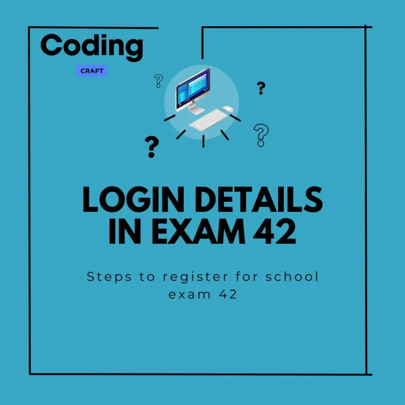
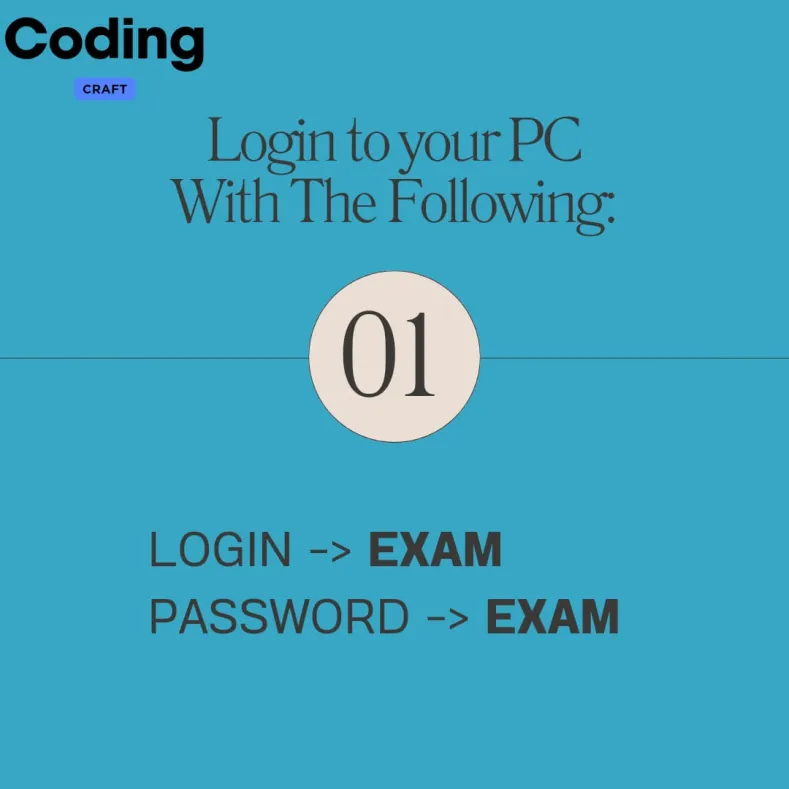
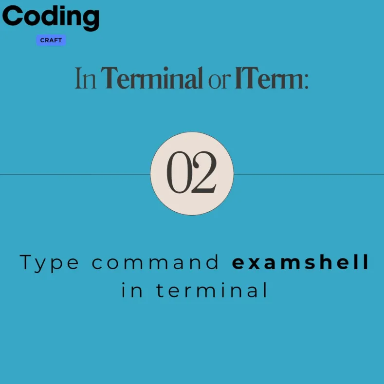
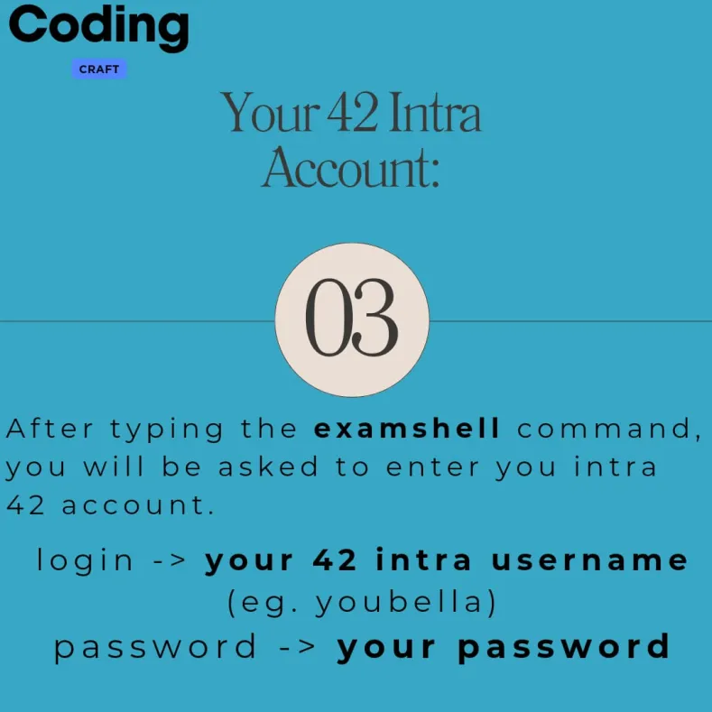
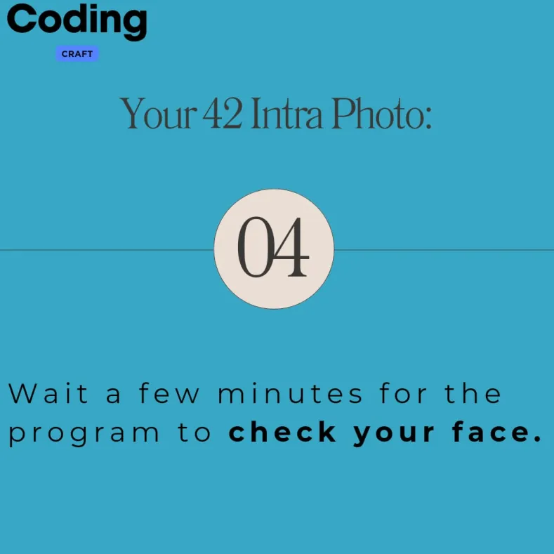
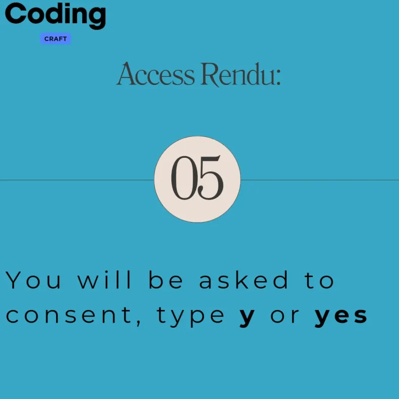
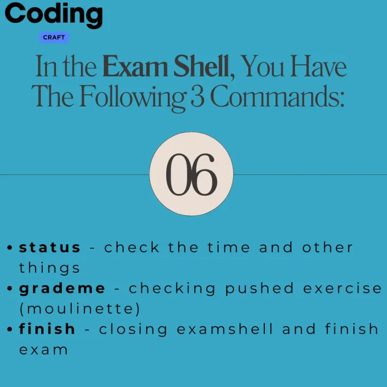
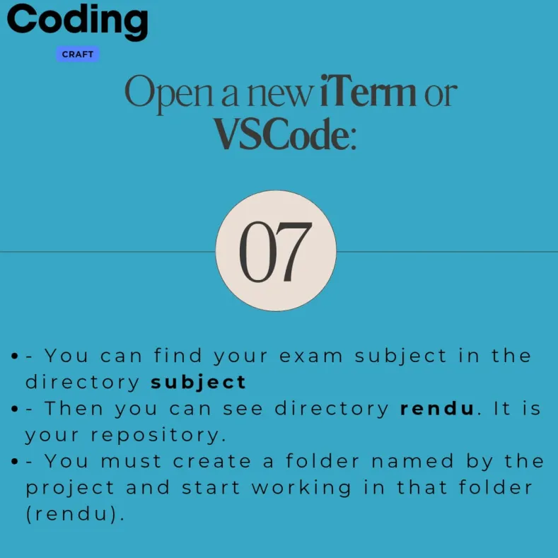
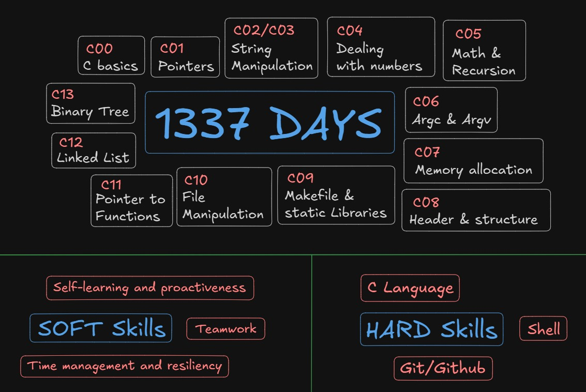

# 42 / 1337 Piscine Pool Experience – C & Shell Projects


---

## Welcome! 😄  

This repository contains **all exercises I completed during the Piscine at 1337**, including:

- `Shell00` ✅  
- `C00 → C09` ✅  
- `Rush00` ✅  

---


## 🏫 About 42

42 is an international tuition-free coding school. **No teachers, no classes, no lectures** — you learn by working on projects, helping peers, and solving problems independently. The campus is open 24/7 and the learning model focuses on **problem-solving, autonomy, and teamwork**.  

---

<br>

## 🏊 Piscine (Pool)

The Piscine is an intensive 1-month program designed to test your **logic, motivation, and learning ability**.  
- Daily projects in Shell and C  
- Team Rush projects  
- **Most important:** never give up! If you fail an exercise or feel discouraged, keep going and ask your peers for help.  


> The full Piscine program includes **Shell00 to Shell01**, **C00 to C13**, and **Rush00 to Rush03** (or Rush02).


I may **add a full README for each day later**, or maybe I already did and forgot to remove this note 😅.

---

<br>

## 📂 Repository Structure
```c
Shell00/
C00/
C01/
C02/
C03/
C04/
C05/
C06/
C07/
C08/
C09/
Rush00/

```
---

<br>

## 📊 My Progress

| Project / Day | Score |
|---------------|-------|
| **Shell00 – Shell Basics** | 100 |
| **C00 – Intro to C** | 85 |
| **C01 – Pointers & Memory** | 100 |
| **C02 – Strings & Arrays** | 85 |
| **C03 – Advanced String Manipulation** | 100 |
| **C04 – Integers & Bases** | 100 |
| **C05 – Recursion & Iteration** | 85 |
| **C06 – `argc` & `argv`** | 100 |
| **C07 – Dynamic Memory Allocation** | 100 |
| **C08 – Headers, Macros & Structs** | 100 |
| **C09 – Libraries & Makefiles** | 100 |
| **Rush00 – First Team Project** | 116 |
| **Exam 00** | 100 |
| **Exam 01** | 100 |
| **Exam 02** | 100 |
| **Final Exam** | 72 | 

<br>

## ✅ Evaluation System

42 evaluates your projects and exercises through multiple stages:  

- **Norm:** Your code is checked for coding style rules (indentation, function length, file structure).  
- **Correction (Peer-to-Peer):**  
  - A fellow student tests your code.  
  - You must **explain your solution** and answer all questions in the correction sheet.  
  - **Points system:** You gain **1 point** for correcting someone else and lose **1 point** if someone corrects you.  
- **Moulinette:** After passing peer correction, your code is automatically tested for correctness, edge cases, and memory issues.

  ---

<br>

## 🧪 Exams

- Exercises are **level-based**, starting from level 0. You get a **random exercise** at your level; if you pass it, the next level is unlocked.  
- Exams test your **logic, correctness, problem-solving, and coding habits**.  
- **Do not start anything until staff tells you to begin.**
  
<br>

## 🔐 Login & Exam Workflow

<br>

 ***Step 0: Do not forget to register for the exam before the exam day. Ask your peers how to register.***
 
<br>

1. Go to a **school computer** before the exam starts and wait until staff tell you to start .  
2. Set your **username** and **mod password** both as `exam`. You have **10 minutes** to do this or you fail.  
3. Open terminal and run or it s open automatic as i remember :  
   ```bash
   examshell
   ```
4. Enter your real intra username and password.

5. The folders you should use:

``` 
For the exams, you should open 3 or 4 terminals to work efficiently.
I also recommend researching more about the login process on YouTube or other articles
or asking peers who already have Piscine experience for guidance.
```

- the orgin one when you do examshell appear

- subject → exam subject files

- rendu → where you write your solutions and push them

- traces → check failing tests (file_name0, file_name1, etc.) optional but important

***Use traces to debug failing test cases.***

Push exercises directly from your computer (no git clone needed):
```c
git add filename
git commit -m "any message"
git push
```

5- do gradme at the origin folder
```
grademe
```
<p align="center"> 
These images explain the exam logs.
</p>

<p align="center">
  
  
  
</p>
<p align="center">
  
  
  
</p>
<p align="center">
  
  
  
</p>

<br>

## 🔁 Recoding Phase

The Recoding phase ensures that you **really understand your code**, not just that it passes tests.  

- Staff may call you after projects or exams to **explain and debug your work live**.  
- You may also be given **exercises at the level of your completed days and exams** to solve on the spot.  
- During recoding, you may be asked to:  
  - Rewrite parts of your code  
  - Answer detailed questions about your solution  
  - Show your reasoning and problem-solving approach  
- Staff checks your understanding of **logic, edge cases, memory management, and adaptability**.  
- Passing the Moulinette does **not** guarantee passing recoding — this phase tests **true knowledge**.  


---

<br>


## 📝 Piscine Day-by-Day – Fully Informative



| Day / Project                          | What It Really Involves                                                                                                     | Key Tasks & Exercises                                                                                   | What You Learn / Skills Gained                                                                                           |
| -------------------------------------- | --------------------------------------------------------------------------------------------------------------------------- | -------------------------------------------------------------------------------------------------------- | ------------------------------------------------------------------------------------------------------------------------ |
| **🐚 Shell00 – Shell & Unix Fundamentals** | Learn how to use the Unix/Linux shell like a real developer: navigate directories, manage files, work with pipes and redirections, explore environment variables, check permissions, write simple shell scripts, and use Git for version control. You will also practice combining commands, chaining operations, and debugging scripts in a live environment. | Create, move, copy, delete files/directories (`mkdir`, `rm`, `cp`, `mv`), list and explore files (`ls`, `find`, `tree`), redirect outputs (`>`, `>>`), use pipes (`\|`) to chain commands, write small scripts (`.sh`) to automate tasks, initialize Git repos, commit changes, push to repo you already have. | Terminal fluency, scripting basics, file system understanding, automation skills, Git workflow (commit & push), debugging shell scripts, environment familiarity. |
| **C00 – Intro to C**                    | Basic C programming: syntax, variables, functions, loops, conditionals, and output. Anda intro to building small programs that compile cleanly. | `ft_putchar`, `ft_print_alphabet`, `ft_print_reverse_alphabet`, `ft_print_numbers`, simple arithmetic exercises, basic `main()` and functions. | Basic C syntax, compilation with `gcc`, understanding function calls, loops, conditionals, working with standard output. |
| **C01 – Pointers & Arrays**             | Introduction to pointers and arrays: how memory is referenced, accessed, manipulated, and passed to functions. | Swap integers using pointers, pointer dereferencing, simple array manipulation, multiple levels of pointers. | Memory addresses, pointers, passing by reference, arrays interaction, debugging memory issues, pointer logic. |
| **C02 – Strings & Arrays**              | Handling strings and character arrays; implement basic library-like functions manually without using `<string.h>`. | Implement `ft_strlen`, `ft_strcpy`, `ft_strcmp`, `ft_strdup`. Iterate over char arrays and handle null-terminated strings. | String manipulation, memory layout, array handling, defensive programming, safe character operations. |
| **C03 – Advanced String Manipulation**  | More advanced string tasks. Handling more complex transformations and edge cases. | Capitalize text, check printable characters, handle concatenation safely, manipulate strings with multiple rules. | Defensive programming (think through edge cases), deeper string logic, character operations. |
| **C04 – Integers & Bases**             | Work with numeric logic and base conversions, including implementing functions not available in the standard library. | Convert numbers to binary/octal/hexadecimal, map digits to chars, perform arithmetic without standard library; implement custom base conversions. | Numeric reasoning, conversion between representations, breaking problems into algorithmic steps. |
| **C05 – Recursion & Iteration**         | Practice recursive programming and iteration; compare both techniques. | Recursive factorial, power functions, Fibonacci numbers, sequence printing; iterative equivalents. | Understand recursion and iteration, call stack, recursive function design, algorithmic thinking, debugging recursive logic. |
| **C06 – `argc` & `argv`**               | Command-line argument handling. Programs read and process parameters from CLI. | Sum numbers from CLI, validate arguments, handle incorrect parameters gracefully. | How to read CLI arguments, parse input, validate and respond, design flexible command-line programs. |
| **C07 – Dynamic Memory Allocation**     | Use `malloc` and `free` to allocate memory dynamically. Manage heap memory safely. | Create dynamic arrays, copy strings, build flexible data structures, free memory to avoid leaks. | Dynamic memory handling, safe allocation/deallocation, heap memory management, working with runtime-sized structures. |
| **C08 – Headers, Macros & Structs**    | Organize code into multiple files, use headers, macros, and structs. Modular coding practice. | Split code into `.c` and `.h` files, define and use structs, implement macros, modularize functions. | Modular programming, maintainable code, reusable structures, better project organization, teamwork readiness. |
| **C09 – Libraries & Makefiles**        | Build systems, compile multi-file projects, static libraries, automated builds. | Write Makefiles that compile multi-file projects, create static libraries, automate linking. | Build automation, code reuse, dependency management, project organization, prepare for large codebases. |
| **🚀 Rush00 – First Team Project**     | Timed team project integrating all Shell and C skills. Realistic project environment with collaboration and deadlines. | Coordinate with peers, integrate exercises, follow project specifications, debug and test code collaboratively. | Teamwork, communication, group problem-solving, time management, real world integration of key skills. |

<br>

# 💡 Advice
```
___??????????????????
 ```
> Keep going, even if you fail or don’t pass — you may find yourself succeeding in the Piscine.

```
 ___^^^^^^^^^^^^^^^^^^^^^^^^^^^^^^^^^^^^^^^^^^^^^^^^^^^^^^^^^^^^^^^^^^^^^^^^^^^^^^^^^^^^^
 ```
<br>
